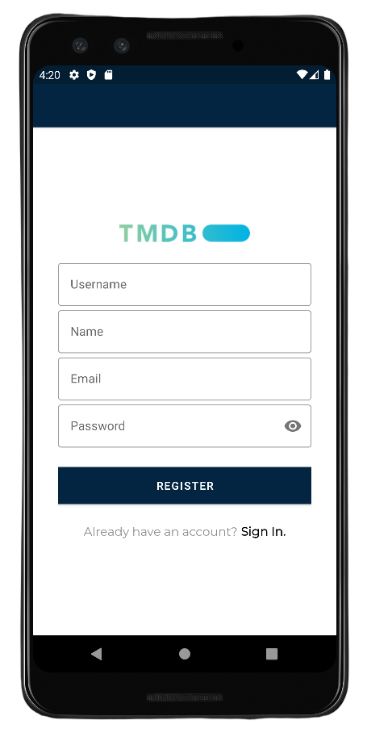

# App Movie (Em construção...)

[](https://kotlinlang.org)

Movie App foi desenvolvido na intenção de praticar e demonstrar uma abordagem moderna para desenvolvimento de aplicativos Android.

O objetivo deste projeto é combinar bibliotecas populares do ambiente Android e demonstrar as melhores práticas de desenvolvimento baseadas nos estudos de SOLID, Android Architecture components, App Modulaziration e Clean Architecture.

Movie App é um aplicativo simples mas que busca ser modular, escalável, sustentável e testável. Este projeto está apenas em seu inicio, onde frequentemente receberá novas features, atualizações, refatoração, entre outras melhorias.




## Características do projeto


* Tech-stack
    * [Retrofit](https://square.github.io/retrofit/) - networking
    * [Jetpack](https://developer.android.com/jetpack)
        * [Navigation](https://developer.android.com/topic/libraries/architecture/navigation/) - in-app navigation
        * [LiveData](https://developer.android.com/topic/libraries/architecture/livedata) - notify views about database change
        * [Lifecycle](https://developer.android.com/topic/libraries/architecture/lifecycle) - perform an action when lifecycle state changes
        * [ViewModel](https://developer.android.com/topic/libraries/architecture/viewmodel) - store and manage UI-related data in a lifecycle conscious way
        * [Room](https://developer.android.com/jetpack/androidx/releases/room) - store offline cache
    * [Kodein](https://kodein.org/Kodein-DI/) - dependency injection
    * [Picasso](https://square.github.io/picasso/)
* Modern Architecture
    * Clean Architecture (at feature module level)
    * Single activity architecture ( with[Navigation component](https://developer.android.com/guide/navigation/navigation-getting-started))
    * MVVM
    * [Android Architecture components](https://developer.android.com/topic/libraries/architecture) 
      * [ViewModel](https://developer.android.com/topic/libraries/architecture/viewmodel) 
      * [LiveData](https://developer.android.com/topic/libraries/architecture/livedata) 
      * [Navigation](https://developer.android.com/jetpack/androidx/releases/navigation)
      * [Android KTX](https://developer.android.com/kotlin/ktx) - Jetpack Kotlin extensions
* UI
    * [Material design](https://material.io/design)
    * Reactive UI
* Gradle
    * Plugins 
      * [SafeArgs](https://developer.android.com/guide/navigation/navigation-pass-data#Safe-args)

## Arquitetura

- `app` - Configuração de aplicativo fundamental
- `library_x` específicos da aplicação dos quais alguns dos recursos podem depender. Isso é útil se você deseja compartilhar alguns ativos ou código apenas entre alguns módulos de recursos (atualmente, o aplicativo não tem esses módulos)

## Estrutura

`Clean architecture` é a" arquitetura central "do aplicativo, então cada` módulo de recursos` contém o próprio conjunto de camadas da arquitetura limpa:

<p align="center">
  
</p>

### Presentation
Essa camada é a mais próxima do que o usuário vê na tela. A camada `presentation` é uma mistura de` MVVM` (Jetpack `ViewModel` usado para preservar os dados durante o reinício da atividade).

Componentes:
- **View (Fragment)** - apresenta os dados na tela e passa as interações do usuário para o View Model. As visualizações são difíceis de testar, portanto, devem ser o mais simples possível.
- **ViewModel** - despacha (por meio de `LiveData`) mudanças de estado para a visualização e lida com as interações do usuário.
- 
### Domain
Esta é a camada central do aplicativo. Observe que a camada `domain` é independente de quaisquer outras camadas. Isso permite fazer modelos de domínio e lógica de negócios independentes de outras camadas.
Em outras palavras, as mudanças em outras camadas não terão efeito na camada `domain`, por exemplo. alterar o banco de dados (camada de `data`) ou a interface de usuário da tela (camada de apresentação) não resultará em qualquer alteração de código dentro da camada de `domain`.

Componentes:
- **UseCase** - contém lógica de negócios
- **DomainModel** - desafia a estrutura central dos dados que serão usados no aplicativo. Esta é a fonte para os dados do aplicativo.
- **Interface do repositório** - necessária para manter a camada `domain` independente da camada de `data` ([Inversão de dependência]

### Data
Gerencia os dados do aplicativo e expõe essas fontes de dados como repositórios para a camada `domain`. As responsabilidades típicas dessa camada seriam recuperar dados da Internet e, opcionalmente, armazenar em cache esses dados localmente.

Componentes:
- **Repositório** está expondo dados para a camada `domain`. Dependendo da estrutura do aplicativo e da qualidade, o repositório de APIs externo também pode mesclar, filtrar e transformar os dados. A intenção dessas operações são para criar uma fonte de dados de alta qualidade para a camada `domain`, não para realizar qualquer lógica de negócios (responsabilidade do `use case` da camada `domain`).

## Clean Architecture

<p align="center">
  
</p>

## Para rodar o projeto no seu Android Studio

1 - Crie um projeto com banco de dados no Firebase. Baixe o arquivo google-services.json deste projeto e adicione ele na pasta **movie-app/app/**
3 - Insira sua chave da API do [The Movie DB](https://www.themoviedb.org/) no arquivo **movie-app/java/olucasmoro.movieapp/app/service/utils/Constants.kt**

## License
```
MIT License

Copyright (c) 2021 Lucas Moro

Permission is hereby granted, free of charge, to any person obtaining a copy of this software and 
associated documentation files (the "Software"), to deal in the Software without restriction, including 
without limitation the rights to use, copy, modify, merge, publish, distribute, sublicense, and/or sell 
copies of the Software, and to permit persons to whom the Software is furnished to do so, subject to 
the following conditions:

The above copyright notice and this permission notice shall be included in all copies or substantial 
portions of the Software.

THE SOFTWARE IS PROVIDED "AS IS", WITHOUT WARRANTY OF ANY KIND, EXPRESS OR IMPLIED, INCLUDING BUT NOT 
LIMITED TO THE WARRANTIES OF MERCHANTABILITY, FITNESS FOR A PARTICULAR PURPOSE AND NONINFRINGEMENT. IN 
NO EVENT SHALL THE AUTHORS OR COPYRIGHT HOLDERS BE LIABLE FOR ANY CLAIM, DAMAGES OR OTHER LIABILITY, 
WHETHER IN AN ACTION OF  TORT OR OTHERWISE, ARISING FROM, OUT OF OR IN CONNECTION WITH THE 
SOFTWARE OR THE USE OR OTHER DEALINGS IN THE SOFTWARE.
```